# 📝 Notes Sharing Application

A full-stack **Notes Sharing Application** built using the **MERN stack** (MongoDB, Express, React, Node.js) with **Firebase Authentication** for secure user login. This app allows users to create, manage, and share notes seamlessly across devices.

## 🚀 Features

- 🔐 Firebase Authentication (Google/Email login)
- 🧠 Create, edit, and delete personal notes
- 📤 Share notes with other users via links
- 📂 Categorize and organize notes
- 🌐 Fully responsive UI with React
- ⚙️ RESTful API with Node.js + Express
- 💾 MongoDB for persistent data storage

## 🛠️ Tech Stack

**Frontend:**
- React.js
- React Router
- Tailwind CSS 

**Backend:**
- Node.js
- Express.js
- MongoDB (with Mongoose)

**Authentication:**
- Firebase Authentication (Email/Password or Google Sign-In)

## 📷 Screenshots

### 🔐 Signup Page
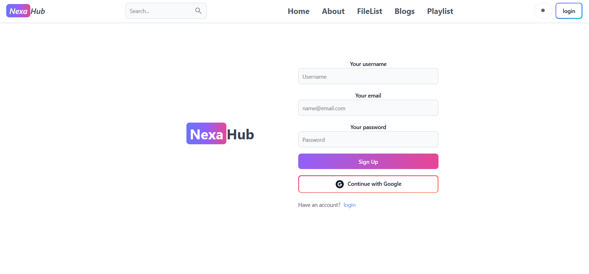

### 🔑 Login Page
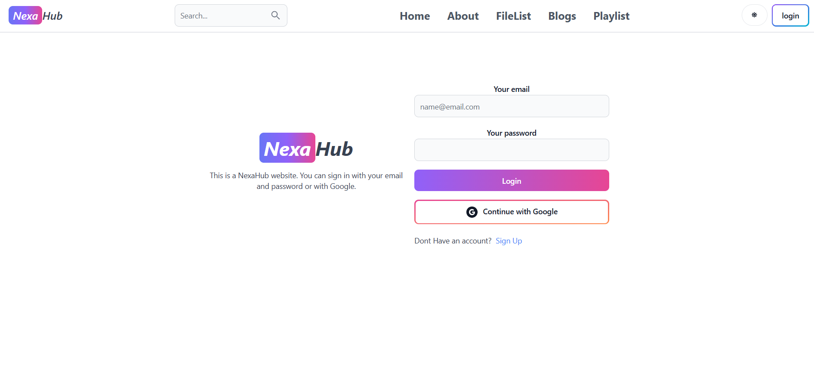

### 🏡 Home
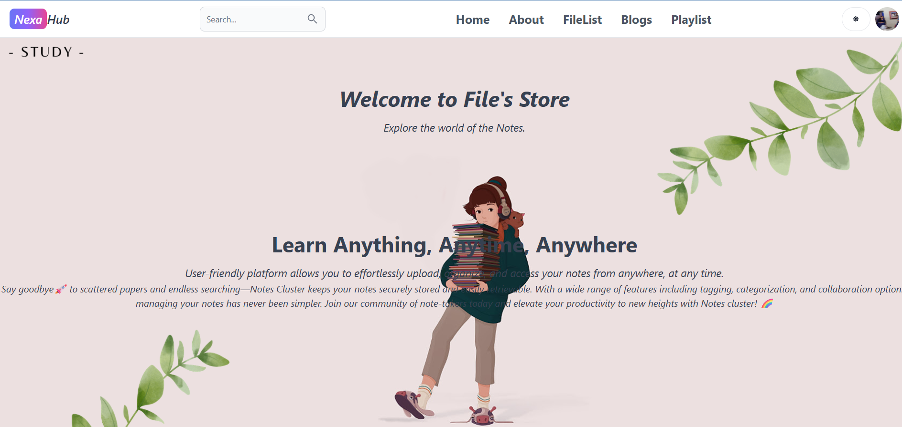

### 📞 About
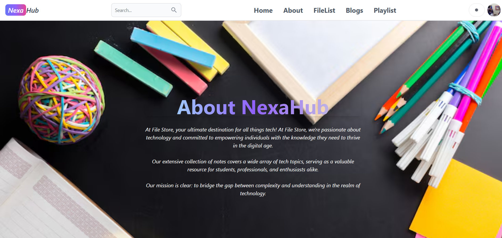

### 🛠️ Admin Profile
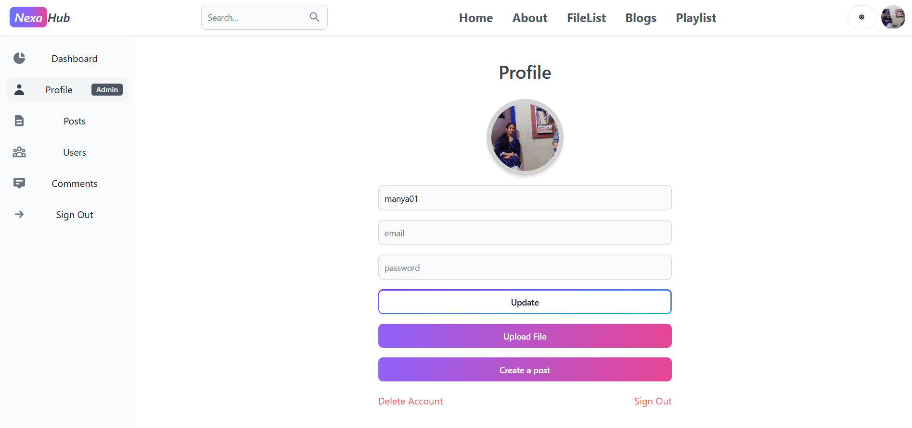

### 👤 User Profiles
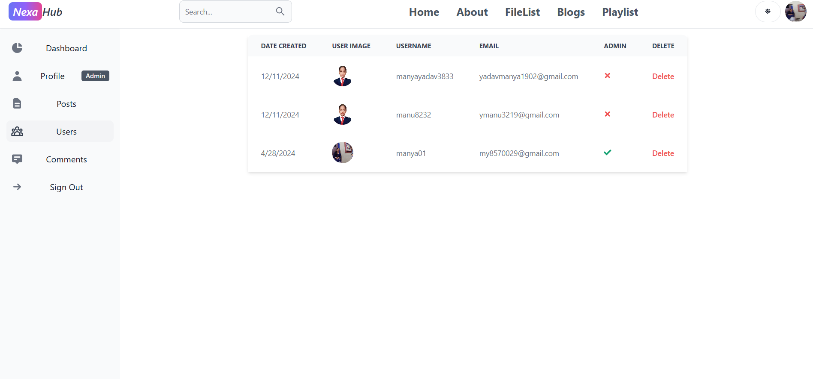

### 🖥️ Dashboard View
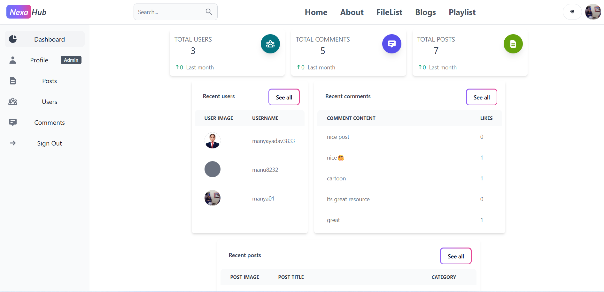

### 📄 Upload Document
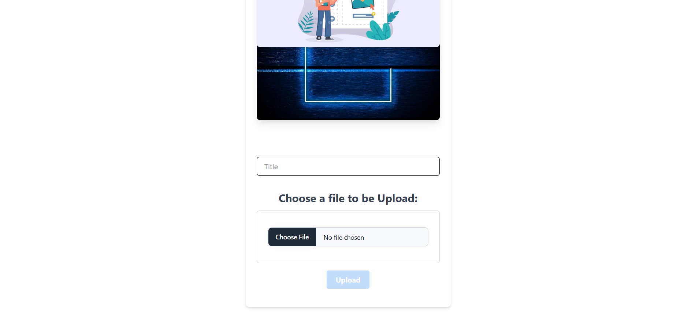

### 🎥 Video Playlist
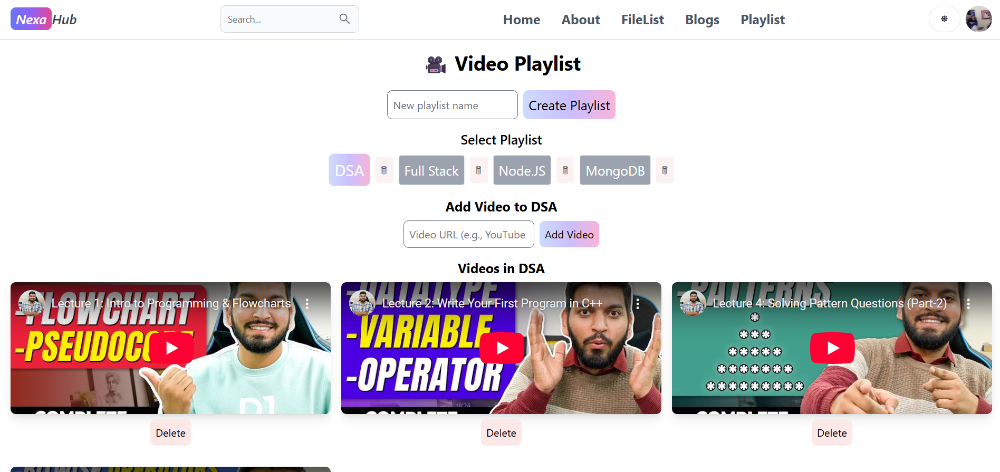

### 📚 PDF View
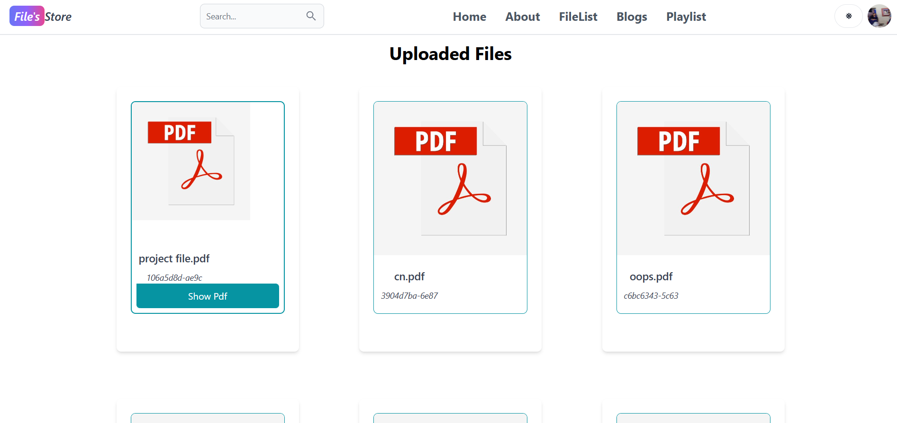

### 🌟 Blog View
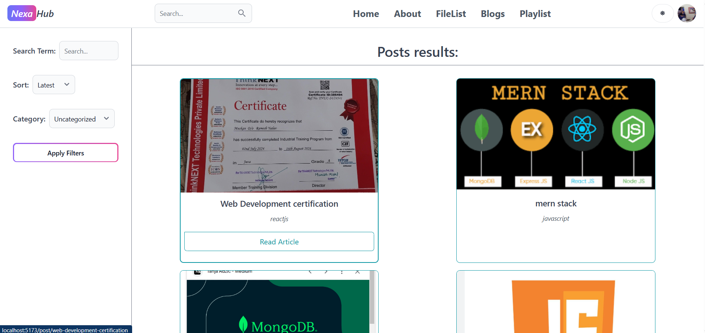

