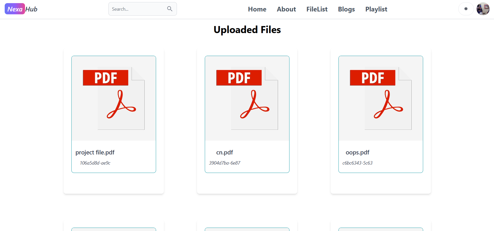
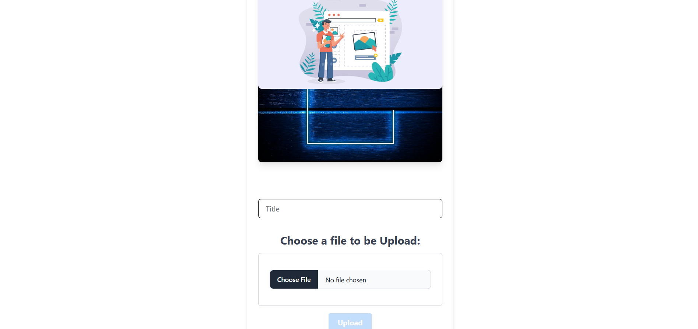

# Study App Project


A full-stack Learning application built using the MERN (MongoDB, Express, React, Node.js) stack.

## Installation

### Prerequisites
Make sure you have the following installed:
- [Node.js](https://nodejs.org/)
- [MongoDB](https://www.mongodb.com/)
- [npm](https://www.npmjs.com/) or [yarn](https://yarnpkg.com/)

### Backend (Node.js + Express + MongoDB)
1. Navigate to the backend folder:
   ```sh
   cd api
   ```
2. Install dependencies:
   ```sh
   npm install
   ```
3. Create a `.env` file and add the required environment variables (MongoDB URI, JWT Secret, etc.)
4. Start the backend server:
   ```sh
   npm start
   ```

### Frontend (React.js)
1. Navigate to the frontend folder:
   ```sh
   cd client
   ```
2. Install dependencies:
   ```sh
   npm install
   ```
3. Start the React app:
   ```sh
   npm run dev
   ```

## How to Start the App
1. Start the api server first:
   ```sh
   cd api
   npm start
   ```
2. Then start the frontend:
   ```sh
   cd client
   npm start
   ```
3. Open the app in your browser at:
   ```
   http://localhost:3000
   ```

## Features
- User authentication (JWT-based login/signup)
- Create, edit, and delete blog posts
- Commenting system
- Image uploads
- Responsive design

## Screenshots
### Login Page


### Signup Page


### Home Page


### About Page


### PDF Section



### Blog Section


### Video  Section


### Admin Profile


### Users Handling Page


### Create Blog Post Page


###  File Uploading



### Dashboard


## Contributing
Feel free to fork this repository and submit pull requests.

## License
This project is licensed under the MIT License.
